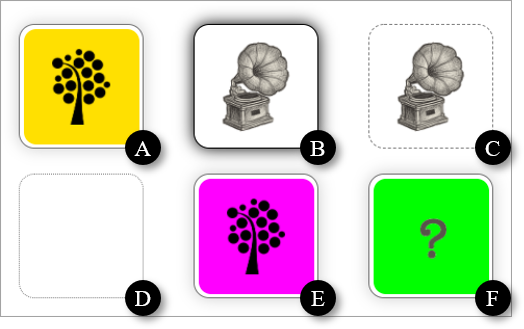

# Det vändbara kortet

I många typer av spel är det vanligt att ett kort ska vändas. Då kortet är vänd nedåt visas dess baksida, som ska vara gemensam för all kort. Är brickan vänd uppåt visas dess framsida. I denna övningsuppgift ska du skapa ett vändbart kort i form av en egen webbkomponenten.

Användaren ska kunna vända på ett kort genom att klicka på det. Ur tillgänglighetssynpunkt ska det självklart vara möjligt att vända på ett kort genom att använda tangentbordet. Används tangentbordet för att vända kort är det viktigt att det framgår vilket kort som har fokus.

Då ett kort vänds ska en händelse utlösas. Händelsen ska innehålla information om vilken sida som visas efter att kortet har vänds.

Ett kort ska kunna vara inaktivt och ska då inte kunna vändas. Ett kort ska även kunna döljas så att varken dess framsida eller baksida visas.

Webbkomponenten ska ha standardvärden för framsida och baksida. Som standard ska framsidan vara tom. Baksidan ska som standard visa LNU:s symbol. Framsidan och baksidans innehåll ska kunna påverkas genom pseudo-elementet `::part`. Det ska även vara möjligt för framsidan att ha innehåll som är "slotted". Katalogen `public/images` innehåller bilder, bland annat en bild med LNU:s symbol, du kan använda.

När ett kort vänds ska ett meddelande med skrivas ut i konsolen innehållande värdet egenskapen `innerHTML` har för det kort som vändes. Utskriften ska självklart inte göras av webbkomponenten.

För presumtiva användare av webbkomponenten är det viktigt att den dokumenteras genom filen `README.md`, som du placerar i webbkomponentens katalog. Se [README.md för &lt;bart-board&gt;](https://gitlab.lnu.se/1dv025/content/exercises/module-b/bart-board/-/blob/master/src/components/bart-board/README.md) för hur du dokumenterar webbkomponenten.

## Ett korts olika status

Nedan visas ett förslag på hur korts olika status kan presenteras. Det står dig fritt att välja hur korts status presenteras.

<ol type="A">
    <li>Kort med baksidan upp.</li>
    <li>Kort som har fokus med framsidan upp (bild "slotted").</li>
    <li>Kort med framsidan upp som är inaktivt.</li>
    <li>Kort som är gömt.</li>
    <li>Kort vars bakgrundsfärg för baksidan som ändrats via <code>::part()</code>.</li>
    <li>Kort vars bakgrundsfärg och bild för baksidan som ändrats via <code>::part()</code>.</li>
</ol>

### Tips!

Ett sätt att hantera ett korts status är att låta webbkomponenten använda booleska attribut tillsammans med CSS-regler, som använder attribut-selektorer.

## Extra funktionalitet

Gör det tydligt för användaren att ett kort vänds.

### Tips!

Genom att använda CSS-egenskapen `transform` , i kombination med några andra CSS-egenskaper, kan element roteras runt lämplig axel.
